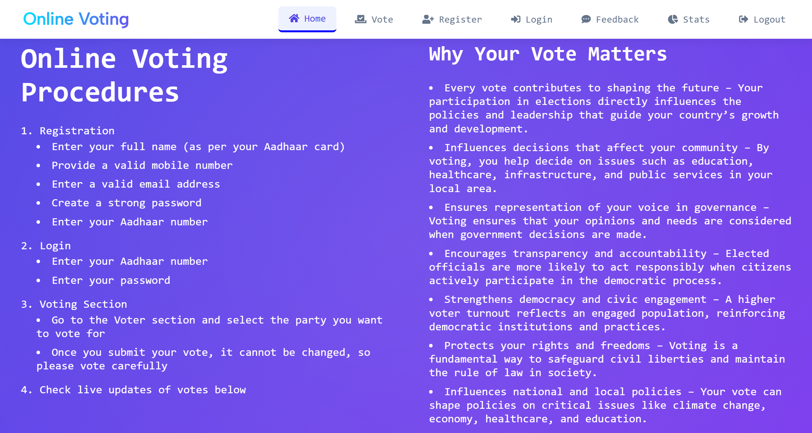
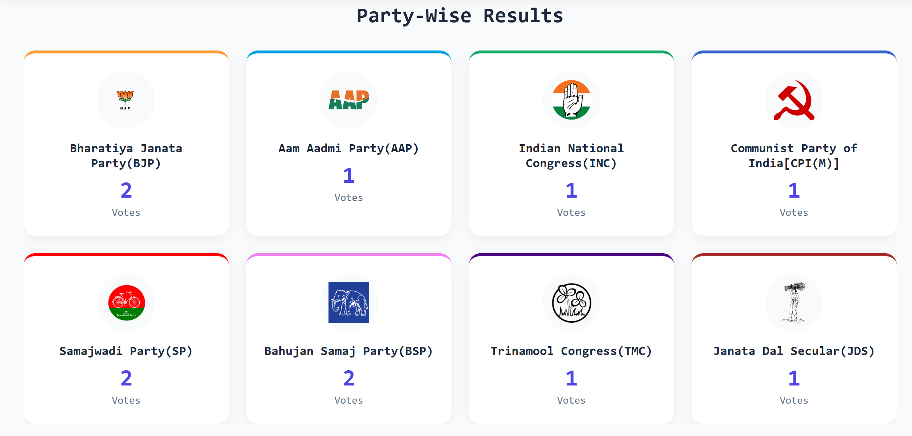
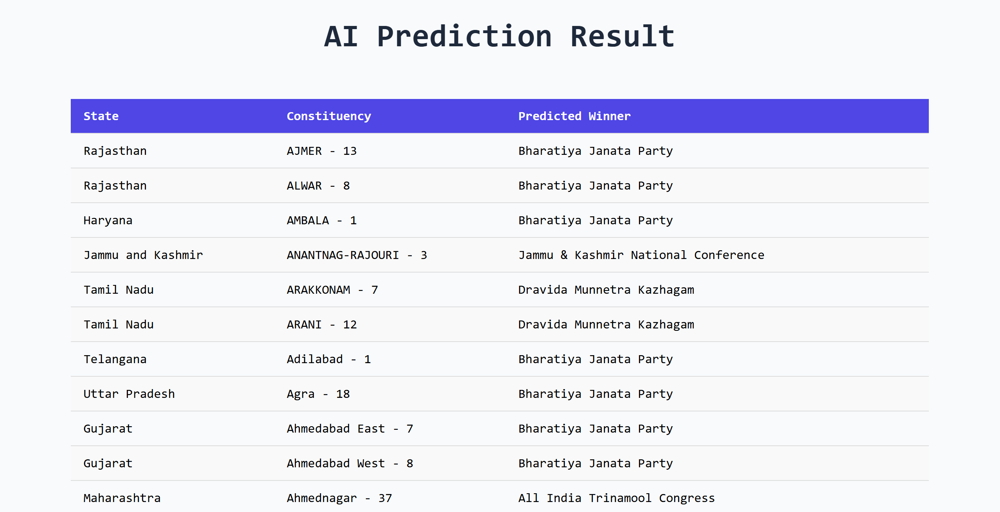
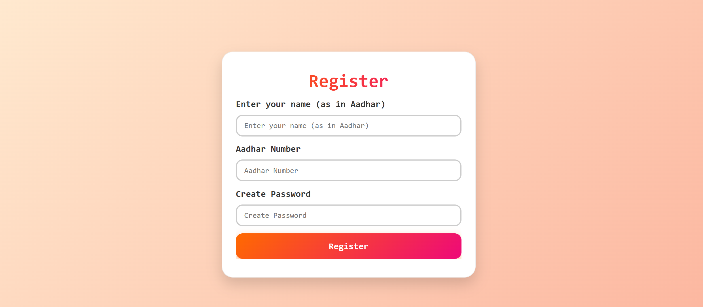
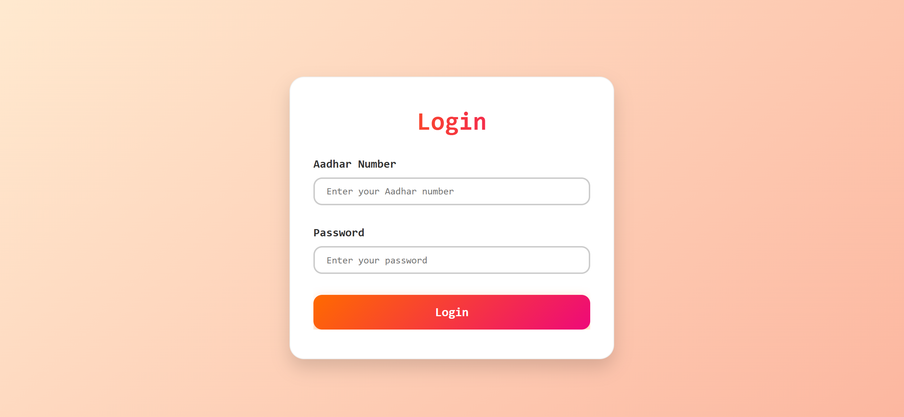
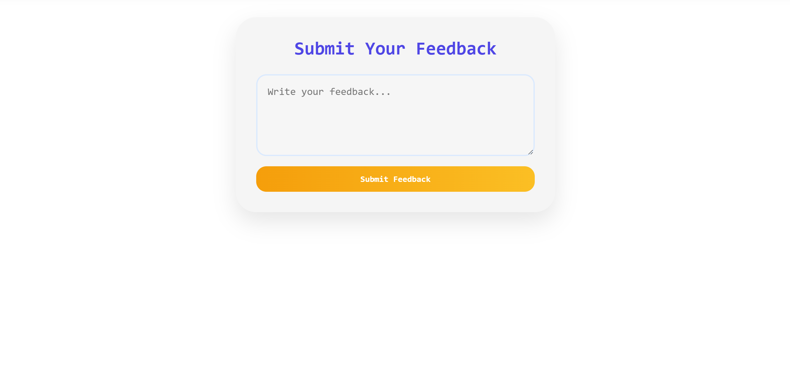

<!DOCTYPE html>
<html lang="en">
<head>
  <meta charset="UTF-8">
  <meta name="viewport" content="width=device-width, initial-scale=1.0">
</head>
<body>

  
  <h1 style="margin: 0; font-size: 28px;">Online Voting: A E-Voting Platform</h1>

A secure and modern <strong>E-Voting System</strong> built with the <strong>MERN stack</strong> and an integrated <strong>Python AI microservice</strong>. 
It allows users to authenticate securely, cast votes digitally, and ensures transparency and integrity in the voting process.

<h2>🚀 Features</h2>
<ul>
  <li>Secure voter authentication (JWT & bcrypt)</li>
  <li>Real-time vote tracking</li>
  <li>Role-based access (Admin, Voter)</li>
  <li>Data persistence with MongoDB</li>
  <li>AI-powered microservice for additional tasks</li>
  <li>Responsive frontend with styled-components</li>
</ul>

<h2>🛠 Tech Stack Used</h2>
<ul>
  <li><strong>Frontend:</strong> React.js</li>
  <li><strong>Backend:</strong> Node.js, Express.js, MongoDB (Mongoose)</li>
  <li><strong>AI Microservice:</strong> Python (FastAPI with Uvicorn)</li>
</ul>

<h2>📦 Packages Used</h2>

<h3>Frontend</h3>
<ul>
  <li>styled-components</li>
</ul>

<h3>Backend</h3>
<ul>
  <li>bcrypt</li>
  <li>cookie-parser</li>
  <li>dotenv</li>
  <li>express</li>
  <li>jsonwebtoken</li>
  <li>mongoose</li>
</ul>

<h2>📂 Suggested File Structure</h2>
<pre>
E-Voting-Platform/
│
├── backend/                # Node.js + Express API
│   ├── controllers/        # Request handlers
│   ├── models/             # Mongoose schemas
│   ├── routes/             # API routes
│   ├── middleware/         # Auth middlewares (JWT, error handling)
│   ├── config/             # DB connection, environment setup
│   ├── utils/              # Helper functions
│   └── server.js           # Backend entry point
│
├── frontend/               # React.js frontend
│   ├── src/
│   │   ├── components/     # Reusable UI components
│   │   ├── pages/          # Page-level components (Login, Dashboard, Voting)
│   │   ├── context/        # State management (React Context/Redux)
│   │   ├── services/       # API calls (Axios)
│   │   └── App.js          # Root React component
│   └── package.json
│
├── ml-service/             # Python AI microservice
│   ├── app.py              # FastAPI main application
│   ├── models/             # ML models / logic
│   ├── requirements.txt    # Python dependencies
│   └── __init__.py
│
├── .env                    # Environment variables
├── README.html             # Project documentation
└── package.json
</pre>

<h2>⚙️ Getting Started</h2>

<h3>1. Start the AI Microservice</h3>
<pre><code>cd ml-service
python -m uvicorn app:app --reload --host 0.0.0.0 --port 5000
</code></pre>

<h3>2. Start the Backend</h3>
<pre><code>cd backend
npm run dev
</code></pre>

<h3>3. Start the Frontend</h3>
<pre><code>cd frontend
npm start
</code></pre>

<h2>📸 Screenshots</h2>

  
  
  
  
  
  
  

<h2>✅ Conclusion</h2>

The <strong>E-Voting Platform</strong> provides a modern, secure, and transparent way to conduct elections digitally. 
By leveraging the power of the <strong>MERN stack</strong> along with a <strong>Python AI microservice</strong>, 
this system ensures scalability, robustness, and trustworthiness. 
It can be further extended with blockchain integration for maximum transparency.

</body>
</html>
